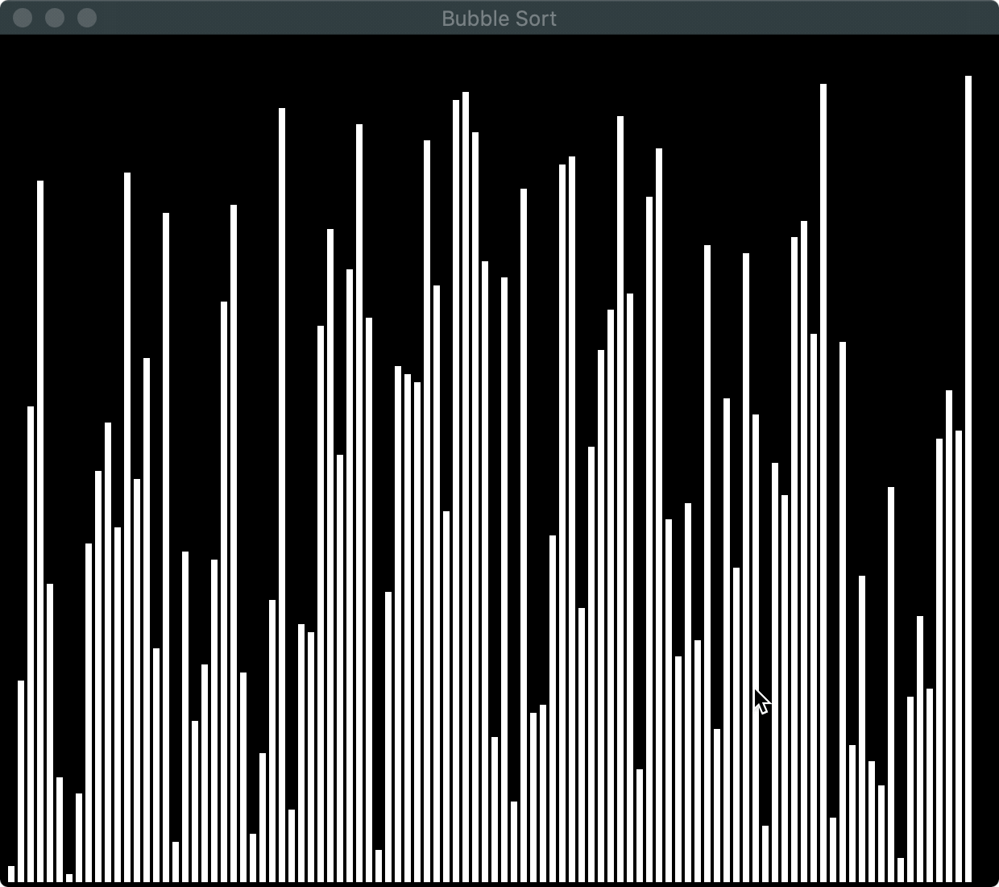
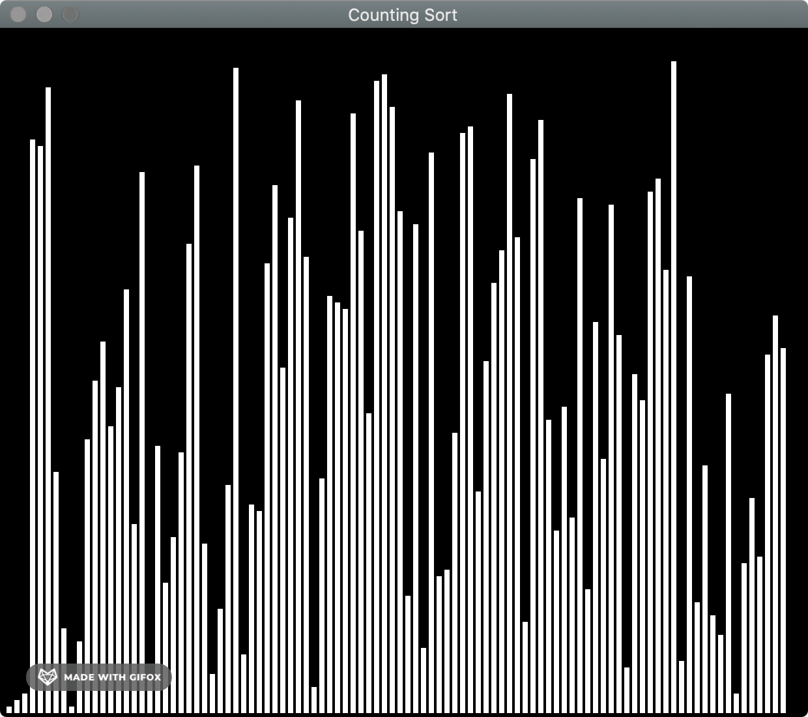
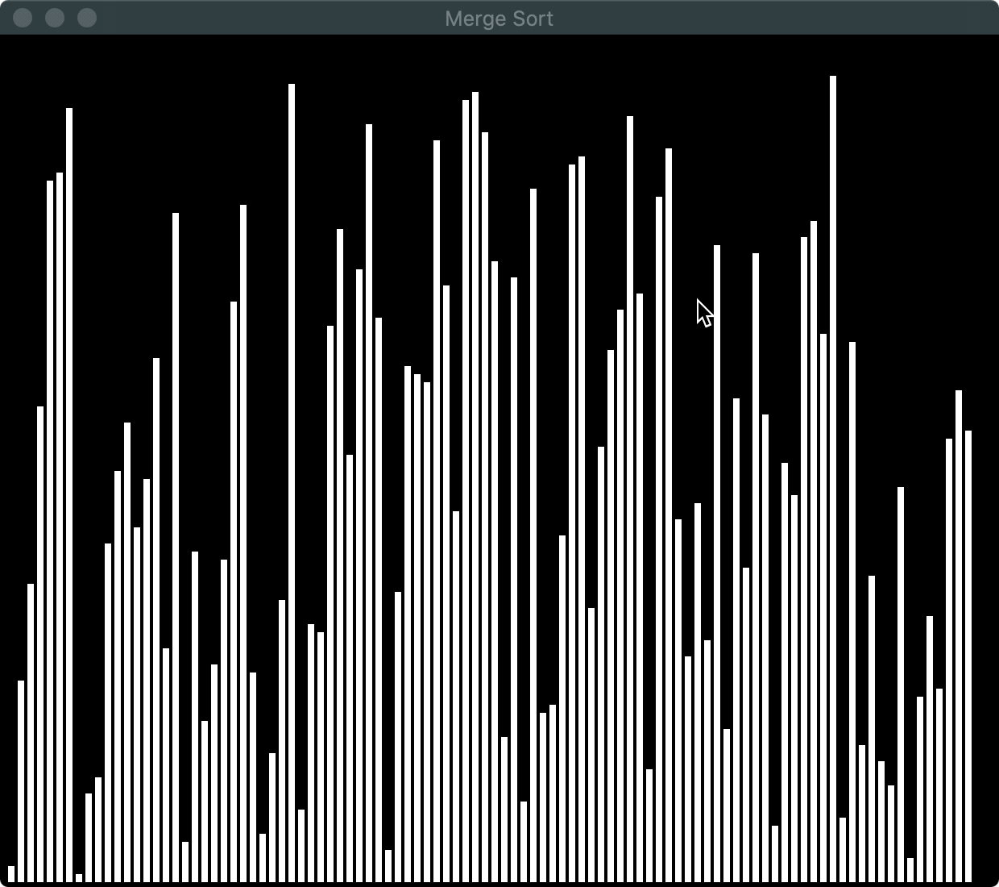
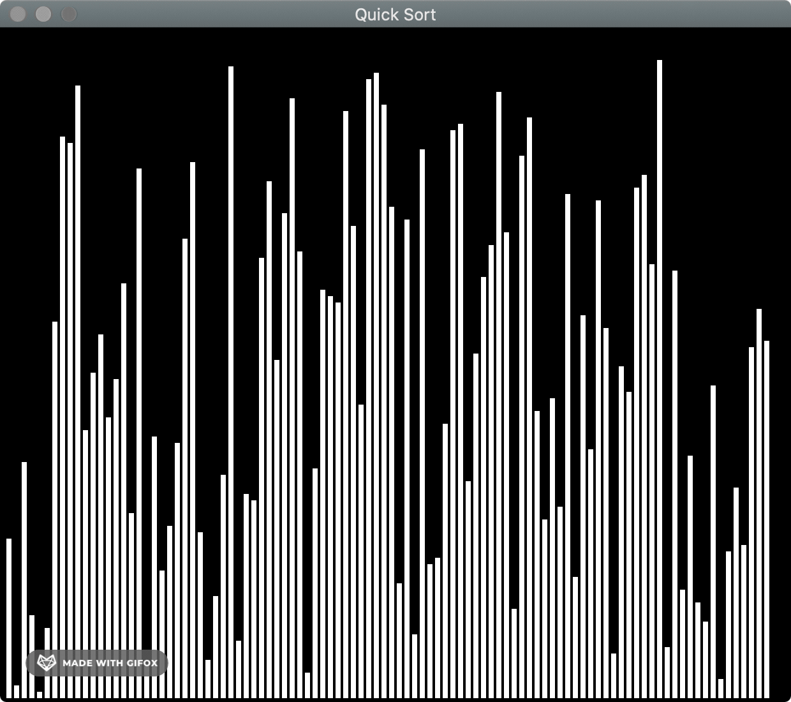
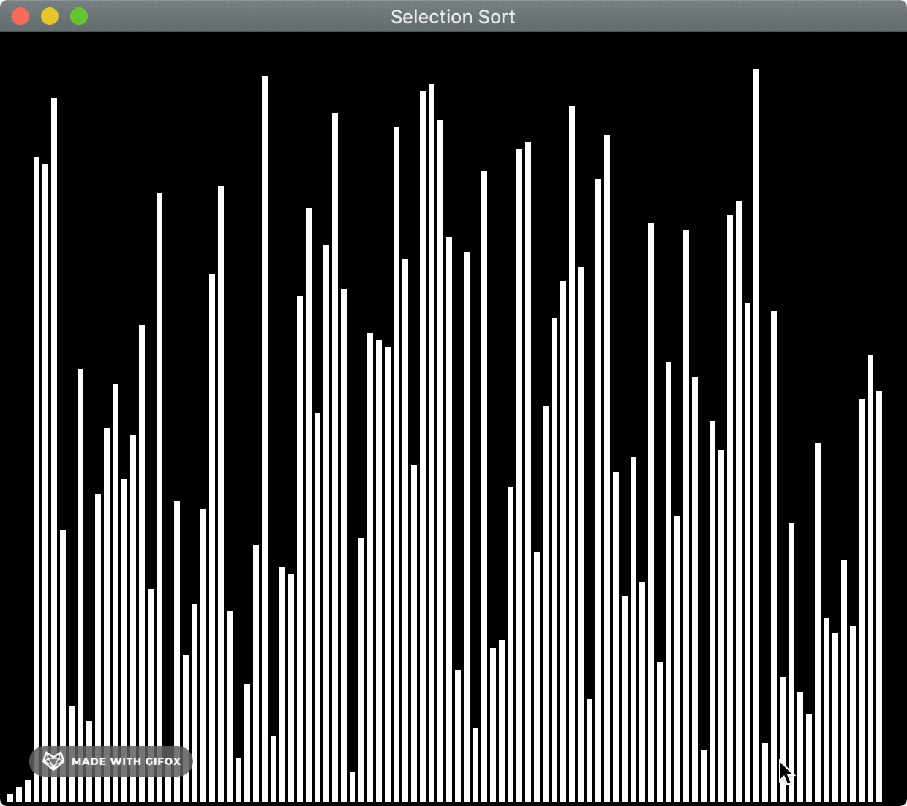

# Sorting Visualizer

Implementation and Visualization of various sorting algothims.
Goal of visualization is to help better understanding how diffrent sorting algorithms work.
Implemented using Java and Swing.

Bubble Sort:

Counting Sort:

Merge Sort:

Quick Sort:

Radix Sort:

Selection Sort:

