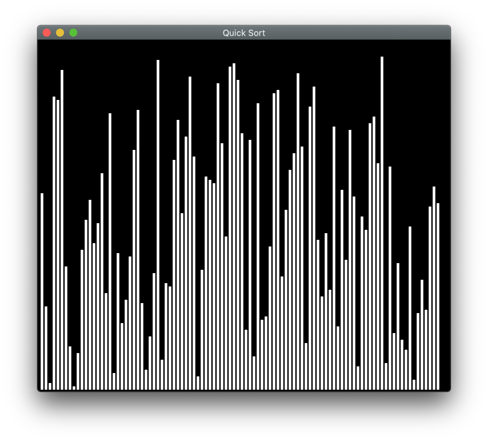
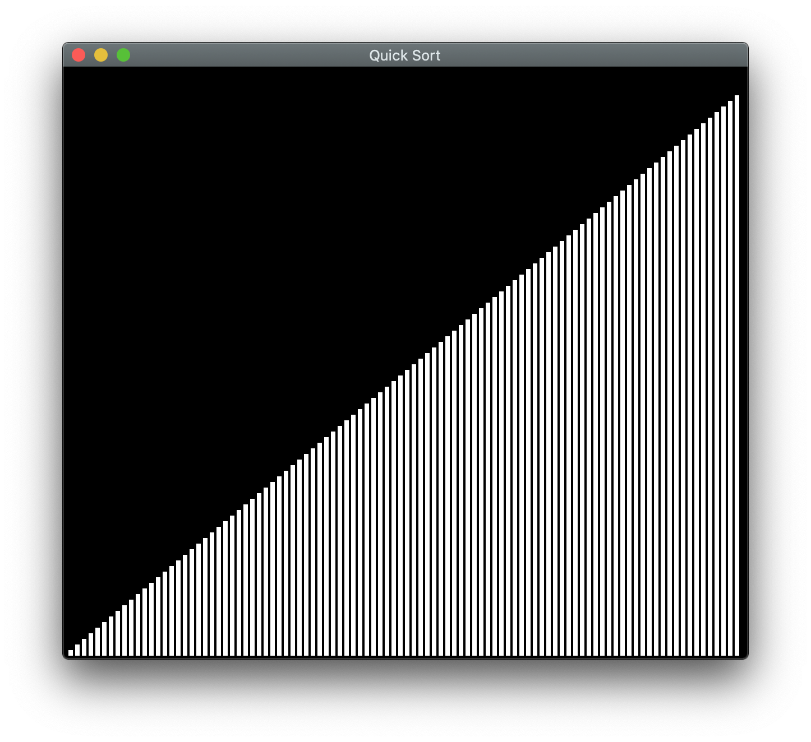

# SortVisualizer

Implementation and Visualization of various sorting algothims.
Goal of visualization is to help better understanding how diffrent sorting algorithms work.
Implemented using Java and Swing.

Unsorted:

Sorted:

